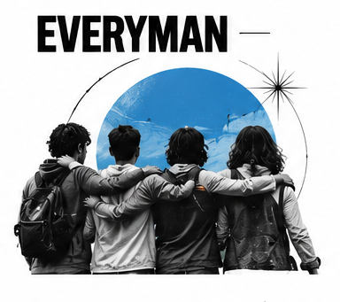

# The Everyman

The Everyman, also called the Regular Guy or Gal, wants to belong without having to pretend. It values the everyday person and the small social rituals that make a place feel familiar. The archetype's promise is not that everyone is identical; it is that nobody needs special status or insider knowledge to take part. Its warmth comes from recognition, inclusion, and an unforced sense of being among peers.

## What it wants

The Everyman seeks belonging, fairness, and practical connection. It is relatable, dependable, and comfortable with ordinary language. Its shadow is blandness: trying to appeal to everyone can erase the details that make a brand recognizable. Another risk is using “ordinary people” as a prop while decisions and benefits remain exclusive. A convincing Everyman brand listens to its community and reflects real differences within it.

## How it looks

Design usually favors accessibility over status signals: clear navigation, familiar materials, readable type, and a welcoming range of colors. A practical palette might use warm red, blue, green, or neutral tones, but it should look like a real choice rather than default corporate blue. Photography can show shared meals, local streets, work, and recreation with people who look like participants rather than cast models. Everyday scenes should be specific and respectful, not staged to imitate “authenticity.”

## How it persuades

The Everyman persuades through shared experience and plain dealing. Customer stories, community recommendations, straightforward prices, and responsive service can all make participation feel low-risk. Social proof is useful when it reflects a genuine range of people and not just a crowd presented as pressure. The voice should be direct without being patronizing. Jokes about “real people” or claims that a brand is “for everyone” ring hollow if the service is inaccessible or the costs are hidden.

## Brands that use it

IKEA, Target, and Levi's have each used Everyman cues in some parts of their identity: practical usefulness, everyday style, or an invitation to participate. These examples are not fixed labels. A retailer can be Everyman in a value campaign and Creator in a customization experience.

## What goes wrong

Trying too hard to sound casual can become forced slang. A brand can also flatten its audience into an imaginary average person. Build closeness through useful details and real listening rather than insisting that the audience is “just like us.” Inclusion needs to be visible in the experience, not only in the copy.

## Sources

- Margaret Mark and Carol S. Pearson, *The Hero and the Outlaw: Building Extraordinary Brands Through the Power of Archetypes* (McGraw-Hill, 2001)
- Carol S. Pearson, *Awakening the Heroes Within* (HarperOne, 1991)
- Robert B. Cialdini, *Influence: The Psychology of Persuasion*, New and Expanded (Harper Business, 2021)