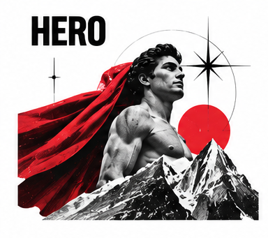

# The Hero

The Hero sees a challenge and steps forward. It is driven to prove that effort, courage, and skill can make a real difference. In brand communication, the archetype promises strength for the task ahead: better equipment, useful training, or a cause worth showing up for. The strongest Hero brands do not make the customer feel small. They help people recognize what they can do.

## What it wants

The Hero wants mastery, courage, and the chance to improve the world through determined action. Its gifts are discipline, resilience, and a willingness to act when the outcome is uncertain. Its shadow is the belief that everything must be a contest. A brand can turn ordinary setbacks into personal failures or suggest that asking for help is weakness. The better Hero makes progress possible, celebrates effort, and leaves room for teamwork.

## How it looks

Hero design should feel active, focused, and capable. Strong contrast, forward motion, purposeful framing, and sturdy typography can communicate momentum without making every page look like a battle poster. Color often includes a confident primary tone with a bright signal accent. Photography works best when it shows people doing something demanding, with visible effort and believable context. A scuffed helmet, a taped-up shoe, or a teammate at the finish line can say more than a perfectly posed champion.

## How it persuades

The Hero persuades by making the challenge concrete and showing a credible path through it. Demonstrations, coaching, measurable progress, and specific proof of performance support the promise. Commitment and consistency can help people build a practice over time; social proof can show that others have made progress too. Use those cues to encourage, not shame. Avoid inflated claims, fear-based urgency, and stories that pretend success is only about individual willpower when access, support, and circumstances matter.

## Brands that use it

Nike often uses Hero storytelling through training, competition, and personal achievement. Under Armour has used a similar performance-and-discipline position, while organizations such as the Red Cross can draw on Hero themes when communicating urgent service and response. These are examples of particular messages, not permanent labels: the same organization may use different archetypes for different audiences or campaigns.

## Hero field notes

- **Good mission:** Help someone take the next brave, practical step.
- **Visual cue:** A figure moving toward the challenge, not posing after it.
- **Pocket motto:** “Courage is a skill. Get a little better at it.”
- **Imaginary sidekick:** A tiny drone named Clipboard that keeps the plan, snacks, and emergency glitter.
- **Plot twist:** The hero's biggest win might be asking the team for backup.

## What goes wrong

The Hero loses trust when every message becomes a dare, every customer is expected to be exceptional, or a product is presented as a substitute for training and support. The archetype can also romanticize burnout and make rest look like surrender. Keep the challenge meaningful, the evidence honest, and the route to progress humane. A good Hero brand gives people tools; it does not demand that they become superheroes to deserve them.

## Sources

- Margaret Mark and Carol S. Pearson, *The Hero and the Outlaw: Building Extraordinary Brands Through the Power of Archetypes* (McGraw-Hill, 2001)
- Carol S. Pearson, *Awakening the Heroes Within* (HarperOne, 1991)
- Robert B. Cialdini, *Influence: The Psychology of Persuasion*, New and Expanded (Harper Business, 2021)
