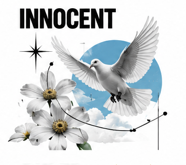

# The Innocent

The Innocent is drawn toward a life that feels good, uncomplicated, and true. In brand-archetype writing, this character is not simply naive or childish. At its strongest, the Innocent holds on to hope without denying that the world can be difficult. Its promise is that people can find goodness, safety, and small moments of joy without having to become cynical first.

## What it wants

The Innocent wants happiness, reassurance, and a sense of moral clarity. It prefers straightforward choices and honest promises to cleverness for its own sake. Its gifts are optimism, trust, and the ability to make ordinary experiences feel restorative. Its shadow appears when simplicity becomes denial: a brand may gloss over real tradeoffs, talk down to adults, or imply that a purchase can make every problem disappear. A credible Innocent voice stays warm while being truthful about what it can and cannot offer.

## How it looks

Innocent design often uses open space, soft daylight, familiar forms, and a restrained palette of clear greens, sky blues, creams, or warm whites. Rounded type can add friendliness, but excessive whimsy quickly makes the brand feel juvenile. Photography works best when it shows real everyday relief: a sunlit kitchen, a shared snack, or someone enjoying a quiet pause. Images should feel candid and attainable rather than airbrushed into perfection. Simple packaging and plain-language labels reinforce the idea that the product is easy to understand.

## How it persuades

Clarity is the main persuasive tool. Short sentences, legible ingredients, a transparent guarantee, or an easy return policy lower uncertainty without manufacturing urgency. Familiar rituals and consistent presentation help people recognize what they are choosing. Social proof can reassure when it comes from relatable customers describing a concrete benefit. The Innocent should avoid fear-based pressure, exaggerated purity claims, and moralizing language. Trust built through candor is more durable than trust demanded through sentimental imagery.

## Brands that use it

Some campaigns from Dove, Innocent Drinks, and Disney emphasize accessible goodness, optimism, and uncomplicated enjoyment. These brands are not one archetype in every market or campaign; the Innocent reading is strongest when the communication makes people feel safe, welcomed, or hopeful rather than impressed by status or technical mastery.

## What goes wrong

The archetype falters when it promises a spotless world and then hides the evidence that reality is messier. It can also blur into generic friendliness if there is no specific point of view. Keep the optimism, but give it something solid to stand on: product facts, honest limitations, and a recognizable human voice.

## Sources

- Margaret Mark and Carol S. Pearson, *The Hero and the Outlaw: Building Extraordinary Brands Through the Power of Archetypes* (McGraw-Hill, 2001)
- Carol S. Pearson, *Awakening the Heroes Within* (HarperOne, 1991)
- Robert B. Cialdini, *Influence: The Psychology of Persuasion*, New and Expanded (Harper Business, 2021)