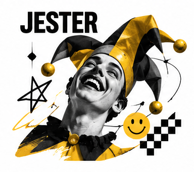

# The Jester

The Jester reminds people that life is not only a list of duties. It finds humor in familiar situations, enjoys the present, and uses play to loosen rigid expectations. In branding, the Jester can make a product feel lively and approachable. Humor is its best-known tool, but its deeper value is permission: people can experiment, laugh at themselves, and enjoy the moment without needing to prove their seriousness.

## What it wants

The Jester seeks joy, spontaneity, and shared amusement. Its strengths are timing, irreverence, and the ability to make a brand memorable without sounding self-important. Its shadow is distraction. A joke can overshadow a product, age quickly, or land badly with people the brand has failed to understand. A good Jester knows its audience, knows when to stop, and never mistakes cruelty for wit.

## How it looks

Jester design can use bold shapes, bright accents, surprising scale, and a lively arrangement that still keeps the message easy to read. Yellow, coral, turquoise, and contrasting colors often suit the mood, but a cheerful palette alone cannot create a comedic voice. Illustration, visual puns, expressive characters, and unexpected product photography may all work. In motion, a pause or reveal can be funnier than constant movement. The visual joke should be legible, accessible, and connected to the idea.

## How it persuades

The Jester earns attention through delight and recall. A funny line can lower social distance and make an offer easier to remember. Playful demonstrations can invite people to try something rather than study it. Humor should not obscure price, risk, or important conditions; nor should it punch down at a vulnerable group. If the campaign is asking for a serious decision, let the joke open the door and then provide the facts clearly.

## Brands that use it

Old Spice, M&M's, and some campaigns from Skittles use Jester-like voices built around absurdity, character, or playful exaggeration. These are campaign-level readings. Each brand uses other tones in other situations, especially where support, safety, or product instructions are involved.

## What goes wrong

The shadow is humor with nowhere to go. A constant stream of gags can make a brand feel exhausting or untrustworthy. Humor also travels unevenly across cultures and generations. Test the joke with the people it is meant to welcome, and make sure the experience after the punchline is just as enjoyable as the advertisement.

## Sources

- Margaret Mark and Carol S. Pearson, *The Hero and the Outlaw: Building Extraordinary Brands Through the Power of Archetypes* (McGraw-Hill, 2001)
- Carol S. Pearson, *Awakening the Heroes Within* (HarperOne, 1991)
- Robert B. Cialdini, *Influence: The Psychology of Persuasion*, New and Expanded (Harper Business, 2021)