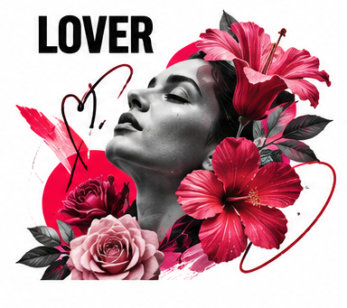

# The Lover

The Lover is about attention and connection. It notices beauty, values sensory experience, and wants relationships to feel meaningful rather than transactional. Although romance is one expression of the archetype, the Lover also includes friendship, devotion, care for craft, and appreciation of the body and senses. Its brand promise is to make an experience feel more intimate, expressive, or worthy of savoring.

## What it wants

The Lover seeks closeness, beauty, and the experience of being valued. Its gifts are warmth, aesthetic sensitivity, and care for detail. Its shadow is possessiveness or insecurity: a brand may imply that people need its product to be attractive, desirable, or lovable. That pressure can turn intimacy into exploitation. The better Lover voice invites rather than shames, and celebrates connection without telling people they are incomplete.

## How it looks

Lover design pays attention to texture, light, rhythm, and tactile detail. Deep reds, rose, plum, or rich natural colors may appear, but the palette should grow from the product and audience rather than rely on stock romance. Photography can focus on gestures, hands, shared meals, materials, or close details that feel observed rather than staged. Typography may be expressive, but elegance should not interfere with readability. In digital work, thoughtful pacing and sensory language can make an interaction feel personal without making it intrusive.

## How it persuades

The Lover persuades through emotional resonance, sensory demonstration, and meaningful personalization. A sample, a beautiful detail, or a story of genuine connection can help the audience imagine an experience. Liking and affinity matter, but they should not be used to manufacture dependency or blur boundaries. Be clear about what the product does, respect privacy, and avoid implying that appearance or partnership is a measure of worth.

## Brands that use it

Chanel, Tiffany & Co., and Häagen-Dazs often use Lover-like cues in selected campaigns: sensual detail, intimacy, or indulgence. These examples describe recurring visual and tonal choices, not the complete identity of each company. An everyday product can use this archetype too if it makes ordinary experience feel considered and personal.

## What goes wrong

The Lover becomes shallow when it reduces connection to seduction or beauty to one narrow standard. It can also overpromise exclusivity while producing a generic experience. Ground the emotion in real craftsmanship, accessible choices, and respect for the audience's own definition of beauty and belonging.

## Sources

- Margaret Mark and Carol S. Pearson, *The Hero and the Outlaw: Building Extraordinary Brands Through the Power of Archetypes* (McGraw-Hill, 2001)
- Carol S. Pearson, *Awakening the Heroes Within* (HarperOne, 1991)
- Robert B. Cialdini, *Influence: The Psychology of Persuasion*, New and Expanded (Harper Business, 2021)