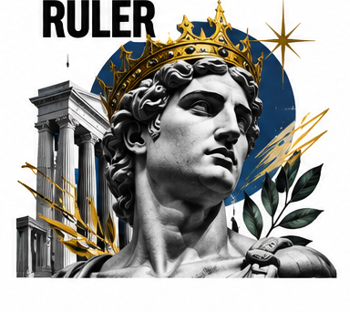

# The Ruler

The Ruler seeks order, responsibility, and the ability to guide a complex situation toward stability. It is not only about crowns or luxury. In brand communication, the Ruler can represent dependable leadership, standards, and confidence that important details are under control. People turn to it when consistency matters and decisions carry consequences. Its authority is strongest when it is earned through competence and fair conduct.

## What it wants

The Ruler values stability, achievement, and stewardship. Its gifts are decisiveness, organization, and a capacity to take responsibility for the whole system. Its shadow is domination: control becomes an end in itself, and status replaces service. An effective Ruler sets clear expectations, explains its decisions, and remains accountable to the people affected by them. Confidence should not become a demand for unquestioned obedience.

## How it looks

Ruler design often uses orderly grids, consistent spacing, strong alignment, and materials that signal durability. Navy, deep green, burgundy, charcoal, or carefully used gold can communicate authority, but quality and precision matter more than a familiar luxury palette. Typography should feel assured and highly legible. Photography may show architecture, skilled professionals, or well-made objects in a composed environment. Avoid visual cues that imply inherited privilege when the brand's actual promise is dependable service.

## How it persuades

The Ruler persuades through proof of reliability: clear standards, demonstrated expertise, stable service, and accountability when something goes wrong. Authority can reduce uncertainty when it is relevant and verifiable. Guarantees, transparent processes, and consistent experiences make the promise tangible. Scarcity or prestige may appear, but they should not substitute for quality or be used to manufacture anxiety. Explain why the audience should trust the organization, and let them inspect the record.

## Brands that use it

Mercedes-Benz, Rolex, and IBM have used Ruler-like signals in some contexts: precision, leadership, and dependable performance. Their identities contain other archetypes too, and the balance shifts by audience and product. A public-service organization may use the Ruler to convey institutional reliability without using luxury cues at all.

## What goes wrong

The archetype fails when it confuses control with care or prestige with proof. Overly formal language can make an organization feel remote, while rigid systems can frustrate the people they are meant to serve. Balance authority with accessibility: hold a clear standard, explain it plainly, and make a real path for feedback and correction.

## Sources

- Margaret Mark and Carol S. Pearson, *The Hero and the Outlaw: Building Extraordinary Brands Through the Power of Archetypes* (McGraw-Hill, 2001)
- Carol S. Pearson, *Awakening the Heroes Within* (HarperOne, 1991)
- Robert B. Cialdini, *Influence: The Psychology of Persuasion*, New and Expanded (Harper Business, 2021)